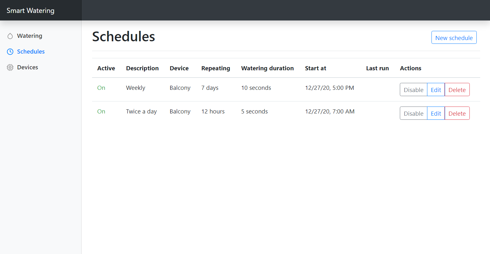

# Smart Watering Service

This application serves as tool for automatized control of plants watering at home. It is designed to be 
running on home server such as Raspberry Pi or any other Linux or Windows center station. It controls 
wireless devices with water pump used for plants watering. Devices must be connected to the network which 
is reachable from the server.

Application implements user-friendly web interface for invoking immediate watering or configuring scheduled
periodic watering. It also monitors current state of connected watering devices. See
[kyberpunk/esp-relay-switch](https://github.com/kyberpunk/esp-relay-switch).

This application was developed just as simple demonstration of home automation. Longer support is not
guaranteed. I am also not responsible for any harms caused by this application. It will be maintained as
long as I use it in my home.



## Used technologies

* Java 14
* [Spring Boot](https://spring.io/projects/spring-boot)
* [Lombok](https://projectlombok.org/) build tool
* [Thymeleaf](https://www.thymeleaf.org/) server-side generated pages
* [Bootstrap](https://getbootstrap.com/) frontend framework  
* ESP-32 SoC with [ESP-IDF SDK](https://docs.espressif.com/projects/esp-idf/en/latest/esp32/)

## Supported devices for watering

* ESP-32 Relay Switch - see [kyberpunk/esp-relay-switch](https://github.com/kyberpunk/esp-relay-switch)
* Planned: ESP-32 Tasmota

It is extensible and can be possibly used for controlling any devices connected over mesh networks such as 
[OpenThread](https://openthread.io/).

## Requirements

Linux or Windows device with Java 14 JRE or Docker.

## Build and Run Watering Service

In order to be able to build the sources you must have Java 14 JDK installed (e.g. [AdoptOpenJDK](https://adoptopenjdk.net/installation.html?variant=openjdk14&jvmVariant=hotspot)).

Build with Gradle and run tests:

```
gradlew build
```

Started with Gradle:

```
gradlew bootStart
```

Run jar directly with java:

```
java -jar /home/spring/watering-service.jar
```

Then open application in browser on [http://localhost:8080](http://localhost:8080).

### Configure database connection

Local H2 database is used by default. Application can connect to any database using Spring JPA implementation.
Application properties must be set accordingly. See [Common Application properties - Data properties](https://docs.spring.io/spring-boot/docs/current/reference/html/appendix-application-properties.html#common-application-properties-data).

Example of application properties for connecting to PostgreSQL database
```
spring.datasource.url=jdbc:postgresql://localhost:5432/postgres
spring.datasource.username=postgres
spring.datasource.password=postgres
spring.jpa.properties.hibernate.dialect = org.hibernate.dialect.PostgreSQLDialect
```

### Configure OAuth2 authentication

There can be optionally enabled OAuth2 authentication. It is implemented using Spring Security OAuth2 Client. Common 
providers are supported - such as Google, Facebook, Keycloak etc. Corresponding Spring application properties must be
set correctly. Property `watering.security` must be set to `oauth2`. See [Spring documentation](https://spring.io/blog/2018/03/06/using-spring-security-5-to-integrate-with-oauth-2-secured-services-such-as-facebook-and-github)
for more information.

Following properties can be set to use OpenID authorization provider with Keycloak:

```
watering.security=oauth2
spring.security.oauth2.client.registration.keycloak.client-name=Keycloak
spring.security.oauth2.client.registration.keycloak.client-id=watering
spring.security.oauth2.client.registration.keycloak.client-secret=secret
spring.security.oauth2.client.registration.keycloak.scope=openid,profile,email
spring.security.oauth2.client.registration.keycloak.authorization-grant-type=authorization_code
spring.security.oauth2.client.registration.keycloak.redirect-uri=https://keycloak/login/oauth2/code/keycloak
spring.security.oauth2.client.provider.keycloak.authorization-uri=http://keycloak/auth/realms/master/protocol/openid-connect/auth
spring.security.oauth2.client.provider.keycloak.token-uri=http://keycloak/auth/realms/master/protocol/openid-connect/token
spring.security.oauth2.client.provider.keycloak.user-info-uri=http://keycloak/auth/realms/master/protocol/openid-connect/userinfo
spring.security.oauth2.client.provider.keycloak.user-name-attribute=preferred_username
spring.security.oauth2.client.provider.keycloak.jwk-set-uri=http://keycloak/auth/realms/master/protocol/openid-connect/certs
```

### Localisation

Application is currently translated to English and Czech. It can be easily translated to other languages
deriving from [this properties file](src/main/resources/messages.properties).

## Use docker image

You can also use prebuilt docker image for running the application. See [kyberpunk/watering-service](https://hub.docker.com/repository/docker/kyberpunk/watering-service)
on Docker Hub. There are available images for architectures: linux/amd64, linux/arm/v7, linux/arm64.

Build image locally:

```
docker build --build-arg JAR_FILE=libs/watering-service-*.jar \
    --build-arg PROPERTIES_FILE=docker/application.properties \
    -t watering-service -f docker/Dockerfile .
```
